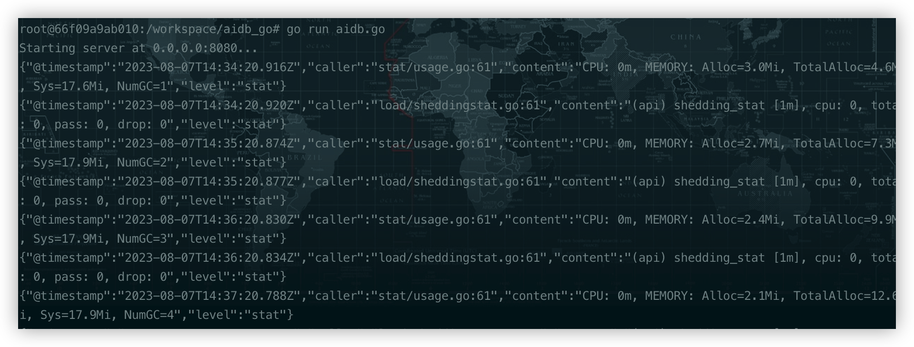

## aidb-go-demo

* CGo demo on Google Colab: [](https://colab.research.google.com/drive/15DTMnueAv2Y3UMk7lhXMMN_VVUCBA0qh?usp=drive_link)

<p align="center">
 
<p align="center">

[AiDB](https://github.com/TalkUHulk/ai.deploy.box) deployed as the server by [go-zeros](https://github.com/zeromicro/go-zero).

## Tested Environment

* Ubuntu 20.04.4 LTS
* go version go1.20.5 linux/amd64


## Usage

* Clone AiDB
```asm
git clone https://github.com/TalkUHulk/ai.deploy.box
```

* Compile AiDB library(custom backend)

```asm
cd ai.deploy.box
mkdir build && cd build
cmake -DC_API=ON -DENGINE_ORT=ON -DENGINE_MNN=ON -DENGINE_NCNN=ON  -DENGINE_TNN=OFF -DENGINE_OPV=OFF -DENGINE_PPLite=OFF -DENGINE_NCNN_WASM=OFF -DBUILD_SAMPLE=OFF ../
make -j8
```
generate **libAiDB_C.so** in ai.deploy.box/build/source/ and put it in internal/aidb/lib

* prepare files demo need.

download [models](https://github.com/TalkUHulk/ai.deploy.box/releases/download/1.0.0/models-lite.zip) and unzip it then rename models, and put ai.deploy.box/extra、ai.deploy.box/config in aidb_go_demo/extra、 aidb_go_demo/config

put [aidb_c_api.h](https://github.com/TalkUHulk/ai.deploy.box/blob/main/source/c_api/aidb_c_api.h) in internal/aidb/include.


* modify port

custom [aidb.yaml](./etc/aidb.yaml)

* Run

```asm
export LD_LIBRARY_PATH=internal/aidb/lib:$LD_LIBRARY_PATH
go run aidb.go
```

<p align="center">
 
<p align="center">

* Test

reference [aidb_client.py](aidb_client.py)


